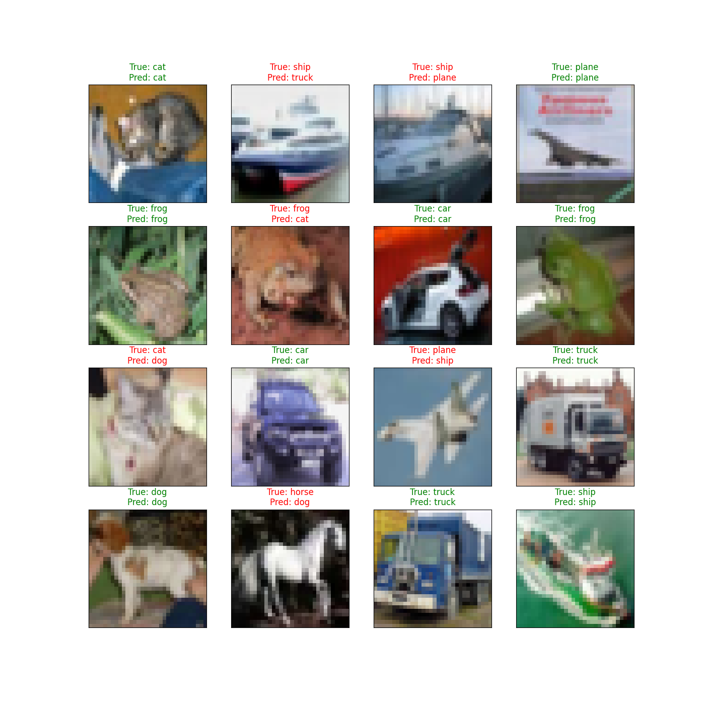
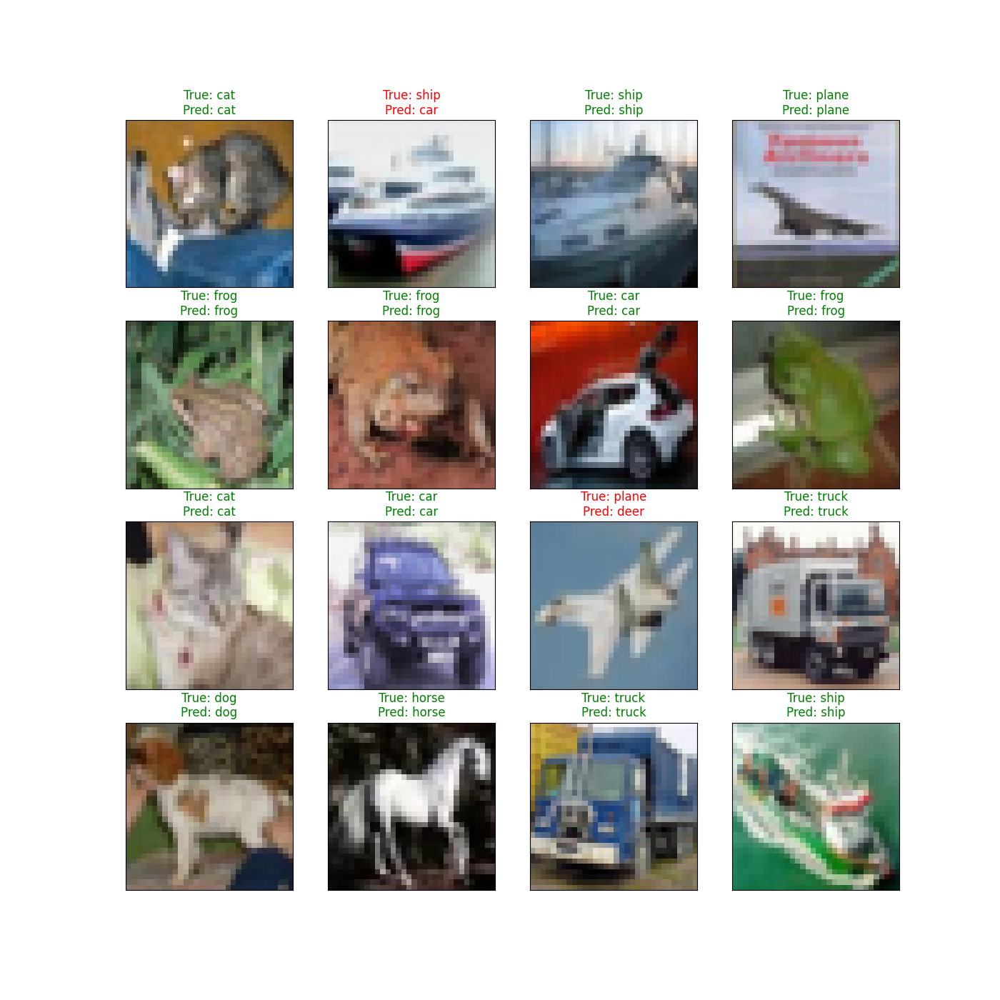
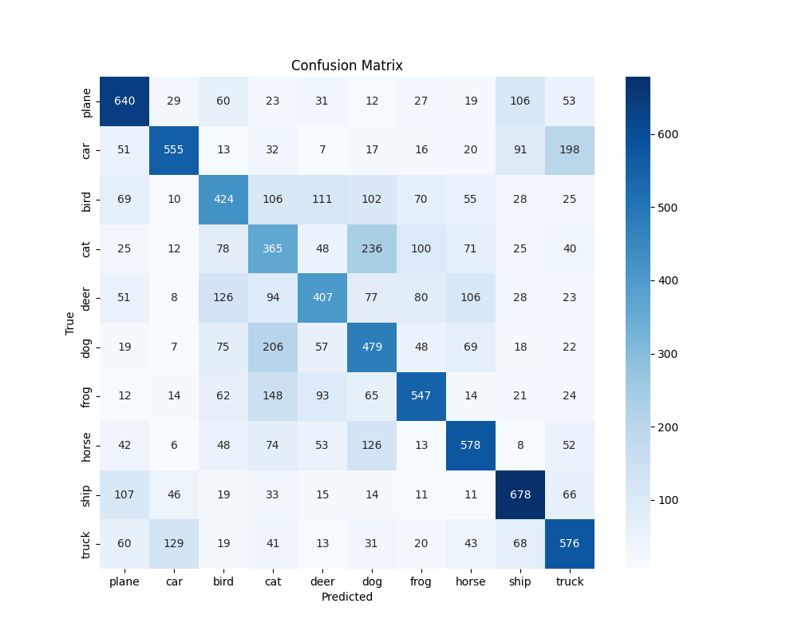
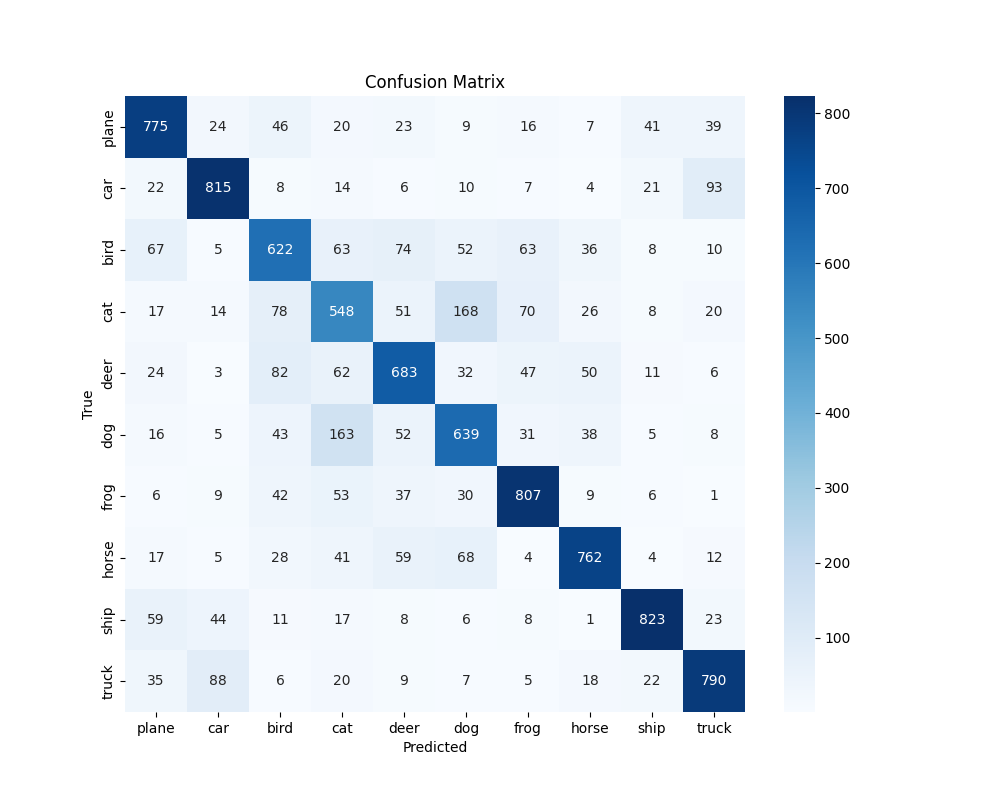

# Image Classification with CNN and MLP on CIFAR-10

## About The Project

In this project, I implemented two types of neural networks for image classification on the CIFAR-10 dataset: a Multilayer Perceptron (MLP) and a Convolutional Neural Network (CNN). The goal was to compare their performance and understand the benefits of using CNNs for image classification tasks.

### Dataset

The CIFAR-10 dataset consists of 60,000 32x32 color images in 10 classes, with 6,000 images per class. The dataset is divided into 50,000 training images and 10,000 test images.

## Results

### MLP Model

- **Architecture**: 7-layer fully connected neural network with ReLU activation functions.
- **Accuracy**: 52,5%
- **Observations**: The MLP model struggled to capture the spatial hierarchies in the images, leading to lower accuracy.

### CNN Model

- **Architecture**: 4 convolutional layers followed by 3 fully connected layers, with ReLU activation functions.
- **Accuracy**: 72,5%
- **Observations**: The CNN model performed significantly better, capturing spatial features more effectively.

### Visualizations

<table>
  <tr>
    <td><b><h3>MLP Model</h3></b></td>
    <td><b><h3>CNN Model</h3></b></td>
  </tr>
  <tr>
    <td></td>
    <td></td>
  </tr>
</table>
<h2>Confusion Matrix</h2>
<table>
  <tr>
    <td><b><h3>MLP Model</h3></b></td>
    <td><b><h3>CNN Model</h3></b></td>
  </tr>
  <tr>
    <td></td>
    <td></td>
  </tr>
</table>

### Dependencies

- Python 3.9
- PyTorch
- torchvision
- Matplotlib
- Seaborn
- Scikit-learn

### Installation

1. Clone the repo

```bash
git clone https://github.com/tom_bou/cifar_image_classifier.git
```
2. Install the required packages
```bash
pip install -r requirements.txt
```
3. Train the model
```bash
python train.py
```
4. Evaluate and create visualizations
```bash
python test.py
```

